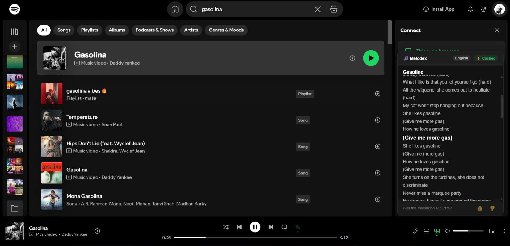
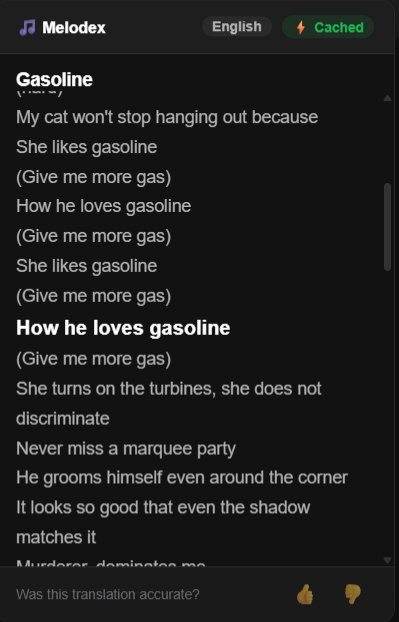
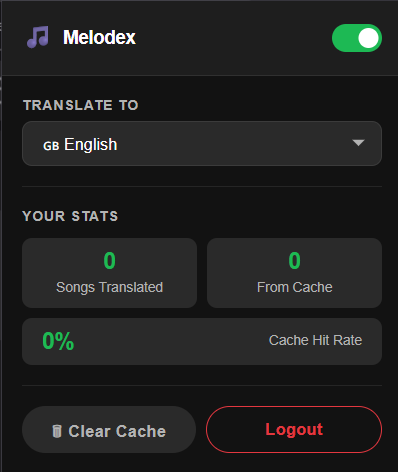

# Melodex 🎵

> Auto-translate Spotify lyrics in real-time — directly in your browser.



Melodex is a Chrome extension that detects the currently playing song on Spotify, fetches its lyrics, translates them into your chosen language, and highlights the active line in sync with the music — all with a two-layer caching system to minimize API calls.

---

## Screenshots

### Translation Panel


### Popup UI


### Real-Time Sync


---

## Features

- 🌍 **Real-time translation** — lyrics translated into 12 languages instantly
- 🎯 **Frame-accurate sync** — 100ms render loop with LRC timestamp matching
- ⚡ **Two-layer cache** — Chrome local storage + SQLite DB reduces API calls by up to 70%
- 👍 **Feedback loop** — thumbs up/down per song stored for analytics
- 🔐 **Spotify OAuth 2.0** — secure login with automatic token refresh
- 📊 **Usage stats** — tracks translations served and cache hit rate in the popup

---

## Tech Stack

| Layer | Technology |
|---|---|
| Extension | Vanilla JavaScript, Chrome Extension API (Manifest V3) |
| Backend | Node.js, Express |
| Database | SQLite (better-sqlite3) |
| Translation | Google Translate API (unofficial) |
| Lyrics | Genius API, lrclib API |
| Auth | Spotify OAuth 2.0, chrome.identity |
| Sync | Spotify Web API, LRC timestamp parsing |

---

## Architecture

```
┌─────────────────────────────────────────────────┐
│              Chrome Extension                    │
│                                                  │
│  detector.js   → detects song via MutationObserver│
│  translator.js → checks local cache → backend    │
│  injector.js   → renders lyrics panel in DOM     │
│  content.js    → orchestrates everything         │
│  background.js → OAuth, API calls, messaging     │
└──────────────────┬──────────────────────────────┘
                   │ POST /translate
┌──────────────────▼──────────────────────────────┐
│              Node.js Backend                     │
│                                                  │
│  /translate  → check SQLite cache                │
│             → fetch lyrics (Genius)              │
│             → fetch timestamps (lrclib)          │
│             → translate lines (Google)           │
│             → save to DB + return                │
│                                                  │
│  /analytics  → store feedback votes             │
│  /auth       → Spotify token exchange + refresh  │
└─────────────────────────────────────────────────┘
```

---

## Local Setup

### Prerequisites
- Node.js v20 LTS
- A Spotify account
- A Genius API key (free at [genius.com/api-clients](https://genius.com/api-clients))
- Chrome browser

### 1. Clone the repo

```bash
git clone https://github.com/YOUR_USERNAME/melodex.git
cd melodex
```

### 2. Set up the backend

```bash
cd backend
npm install
cp .env.example .env
```

Fill in your `.env`:

```bash
PORT=3000
GENIUS_ACCESS_TOKEN=your_genius_token_here
SPOTIFY_CLIENT_ID=your_spotify_client_id
SPOTIFY_CLIENT_SECRET=your_spotify_client_secret
```

Start the backend:

```bash
npm run dev
```

Visit `http://localhost:3000/health` — you should see `{ "status": "ok" }`.

### 3. Set up Spotify OAuth

1. Go to [developer.spotify.com/dashboard](https://developer.spotify.com/dashboard)
2. Create an app named **Melodex**
3. Add this as a Redirect URI:
```
https://YOUR_EXTENSION_ID.chromiumapp.org/
```
4. Copy your Client ID and Client Secret into `.env` and `extension/scripts/background.js`

### 4. Load the extension in Chrome

1. Open `chrome://extensions`
2. Enable **Developer Mode** (top right)
3. Click **Load unpacked**
4. Select the `extension/` folder

### 5. Use it

1. Open [open.spotify.com](https://open.spotify.com) in Chrome
2. Click the Melodex icon → **Login with Spotify**
3. Select your target language
4. Play any song — translated lyrics appear automatically

---

## How Sync Works

```
Spotify API polled every 2s → real progress_ms
          +
100ms render loop → interpolates position between fetches
          +
LRC timestamps → direct 1:1 match to translated line
          =
Frame-accurate highlighting with no drift
```

---

## Project Structure

```
melodex/
├── extension/
│   ├── manifest.json
│   ├── scripts/
│   │   ├── background.js    # Service worker — OAuth, messaging
│   │   ├── content.js       # Orchestrator — connects all scripts
│   │   ├── detector.js      # MutationObserver — detects song changes
│   │   ├── translator.js    # Cache check + backend call
│   │   └── injector.js      # Renders lyrics panel in Spotify DOM
│   ├── popup/
│   │   ├── popup.html
│   │   ├── popup.js
│   │   └── popup.css
│   ├── styles/
│   │   └── lyrics.css
│   └── icons/
│       ├── icon16.png
│       ├── icon32.png
│       ├── icon48.png
│       └── icon128.png
│
└── backend/
    ├── server.js
    ├── routes/
    │   ├── translate.js
    │   ├── analytics.js
    │   └── auth.js
    ├── controllers/
    │   ├── translateController.js
    │   └── analyticsController.js
    ├── middleware/
    │   ├── cors.js
    │   └── rateLimit.js
    └── db/
        ├── database.js
        └── migrations/
            └── init.sql
```

---

## API Endpoints

| Method | Endpoint | Description |
|---|---|---|
| `GET` | `/health` | Server health check |
| `POST` | `/translate` | Translate lyrics for a song |
| `POST` | `/analytics/feedback` | Submit thumbs up/down vote |
| `GET` | `/analytics/stats` | Get usage statistics |
| `POST` | `/auth/callback` | Exchange Spotify auth code for token |
| `POST` | `/auth/refresh` | Refresh expired Spotify token |

---

## Caching Strategy

```
Request comes in
      ↓
Layer 1: Chrome storage (instant, per user)
      ↓ miss
Layer 2: SQLite DB (fast, shared across users)
      ↓ miss
Layer 3: Genius + Google Translate (slow, costs quota)
      ↓
Save to both layers for next time
```

---

## License

MIT © Akshat
